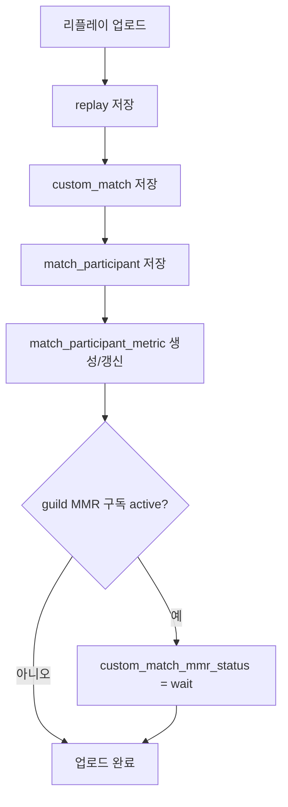
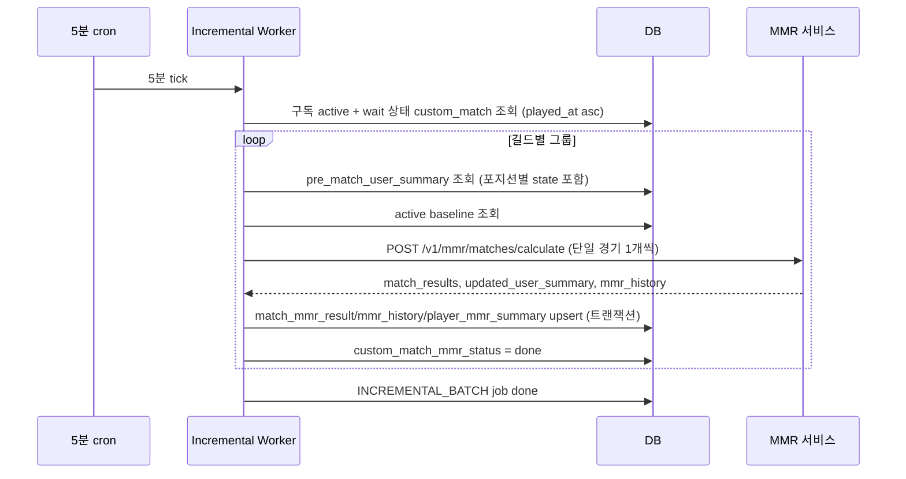
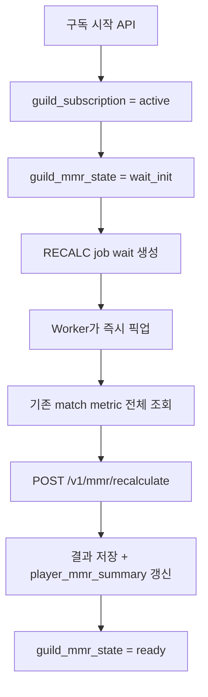

# MMR 백엔드 설계 (확정본)

> 이 문서는 `loltrix_be`(백엔드) 관점의 MMR 통합 설계 확정본이다.
> 짝 문서: `docs/MMR_SERVICE_DESIGN.md` (MMR 서비스 측 설계 — `trcgg/gmok_mmr`에 반영 대상)

## 0. 목적과 범위

길드 단위 MMR 구독 서비스와 통계 집계 기반을 추가한다.
운영 중인 `match_participant` 테이블은 그대로 유지하고, 통계/MMR 공통 입력인 `match_participant_metric`을 별도로 둔다.
MMR은 **신규 경기 단위 incremental**로 계산하고, 전체 재계산(RECALC)은 예외 상황에서만 수행한다.

## 1. 아키텍처 결정 사항 (10개)

| # | 항목 | 결정 |
|---|---|---|
| 1 | MMR 계산 흐름 | **Incremental 중심.** 단일 경기 API 활성화. RECALC는 (신규 구독 init, 시즌 변경, 산식 변경, 운영자 수동) 시에만. |
| 2 | 포지션별 state | **백엔드 저장.** `player_mmr_summary`에 포지션별 컬럼 추가. incremental의 전제 조건. |
| 3 | MMR 서비스 배포 | **별도 인스턴스 상시.** 백엔드와 분리된 노드에서 FastAPI 상시 가동. |
| 4 | 컬럼/식별자/enum 통일 | **백엔드 contract를 SoT로** 두고 MMR 코드(`gmok_mmr`) 내부를 일괄 rename. |
| 5 | Incremental 트리거 | **5분 주기 묶음 worker.** wait 상태의 custom_match를 도착순으로 batch 호출. |
| 6 | 신규 구독 init | **구독 즉시 RECALC 트리거.** wait_init은 사실상 잠깐만 보임. |
| 7 | Baseline 데이터 부족 | **`INSUFFICIENT_DATA` 에러 반환.** 시즌 초기는 baseline 미준비 상태로 정확히 표현. |
| 8 | 경기 필터 | **백엔드 metric의 `is_mmr_eligible boolean`.** 통계는 포함, MMR만 제외. |
| 9 | 재구독 데이터 정리 | **Soft delete + 30일 유예 후 hard delete.** |
| 10 | mmr_history | **처음부터 monthly range partition.** |

## 2. 식별자 / Enum / 단위

### 식별자 (백엔드 ↔ MMR 서비스 공통)
| 항목 | 값 |
|---|---|
| 유저 식별자 | `puuid` |
| 경기 식별자 | `custom_match_id` |
| 길드 식별자 | `guild_id` |
| 시즌 식별자 | `season` |
| 계산 실행 식별자 | `calculation_id` |
| baseline 식별자 | `baseline_version` |
| feature 추출 버전 | `feature_version` |

부계정 통합은 MMR에서 고려하지 않는다.

### Enum
| 필드 | 값 |
|---|---|
| `position` | `TOP`, `JUG`, `MID`, `ADC`, `SUP` |
| `game_team` | `blue`, `red` |
| `game_result` | `1`(승리), `0`(패배) |

### 시간 / 수치
| 필드 | 단위 |
|---|---|
| `time_played` | 초 |
| `played_at` | ISO 8601 datetime string (timezone 포함) |
| `calculated_at` | ISO 8601 datetime string |
| MMR 값 | integer |

## 3. 상태 정의

### `guild_subscription.status`
```
active | inactive | cancelled
```

### `guild_mmr_state.status`
```
idle | wait_init | ready | error
```
| 상태 | 의미 |
|---|---|
| `idle` | MMR 상태 없음/초기 상태 |
| `wait_init` | RECALC job 큐잉됨, 아직 ready 아님 |
| `ready` | MMR 사용 가능 |
| `error` | 마지막 init/배치 실패 |

### `mmr_job.status`
```
wait | run | done | fail | cancel
```
- `job_type`: `INCREMENTAL_BATCH`, `RECALC`, `BASELINE`, `CLEANUP`
- 최대 3회 재시도 (`max_attempts=3`)
- 워커 픽업 시 `SELECT ... FOR UPDATE SKIP LOCKED` 사용

### `custom_match_mmr_status.status`
```
wait | done | fail | skip
```
| 상태 | 의미 |
|---|---|
| `wait` | 아직 MMR 반영 안 됨 |
| `done` | 최신 incremental/RECALC에 반영됨 |
| `fail` | 처리 실패 |
| `skip` | 삭제 또는 `is_mmr_eligible=false`로 제외 |

## 4. 핵심 흐름

### 4.1 리플레이 업로드 흐름



업로드 시점에 MMR 서비스 호출 없음.

### 4.2 5분 주기 Incremental Worker



- 한 5분 tick 내에서도 길드별로 묶고, 길드 내에서는 `played_at` 오름차순으로 **반드시 순차 처리**(MMR 누적 순서가 의미를 가짐).
- 같은 길드 내 동시 worker 픽업 방지: `mmr_job`에 `unique(job_type, guild_id, status=run)` 가정 + advisory lock.

### 4.3 신규 구독 init 흐름



구독 → ready까지 일반적으로 수 분 내 도달 목표.

### 4.4 RECALC 트리거 시점
1. **신규 구독 init**: 자동
2. **시즌 변경**: 자동(새 시즌 키로 신규 state 생성)
3. **알고리즘/baseline 변경 후 보정**: 운영자 수동
4. **사고 복구**: 운영자 수동

> 일상 운영에서는 RECALC를 돌리지 않는다. Incremental만으로 정합 유지.

### 4.5 일일 정합성 체크 (10시 KST)
RECALC가 아닌 **검증/정리 작업**:
1. `custom_match_mmr_status`에서 24시간 이상 `wait`인 row 알람
2. `is_deleted=true`인 custom_match의 `custom_match_mmr_status = skip` 정리
3. 재구독 soft delete 30일 경과분 hard delete
4. 메트릭/baseline 정합성 sample 검사(선택)

## 5. DB 스키마 (드리즐 신규 추가분)

### 5.1 `guild_subscription`
| 컬럼 | 타입 | 비고 |
|---|---|---|
| id | uuid PK | |
| guild_id | varchar(128) FK → guild.id | |
| service_key | varchar(32) | 예: `MMR` |
| status | varchar(16) | `active`/`inactive`/`cancelled` |
| enabled_at | timestamptz | |
| ended_at | timestamptz nullable | |
| metadata | jsonb | |
| create_date / update_date | timestamptz | |

제약: `unique(guild_id, service_key)`

### 5.2 `guild_mmr_state`
| 컬럼 | 타입 | 비고 |
|---|---|---|
| id | uuid PK | |
| guild_id | varchar(128) | |
| season | varchar(32) | |
| status | varchar(16) | `idle`/`wait_init`/`ready`/`error` |
| initialized_at | timestamptz nullable | |
| last_calculation_id | varchar(64) nullable | |
| last_job_id | uuid nullable | |
| error_message | text nullable | |
| create_date / update_date | timestamptz | |

제약: `unique(guild_id, season)`

### 5.3 `mmr_baseline`
| 컬럼 | 타입 | 비고 |
|---|---|---|
| id | uuid PK | |
| season | varchar(32) | |
| baseline_version | varchar(32) | |
| mmr_baseline | jsonb | f1_mean, f2_mean 등 |
| game_impact_baseline | jsonb | position_weights, outcome_stats |
| metadata | jsonb | match_count, row_count, calculated_at |
| is_active | boolean | 시즌별 active 1개 |
| calculated_at | timestamptz | |
| create_date / update_date | timestamptz | |

제약: `unique(season, baseline_version)` + `partial unique(season) where is_active = true`

### 5.4 `mmr_job`
| 컬럼 | 타입 | 비고 |
|---|---|---|
| id | uuid PK | |
| guild_id | varchar(128) nullable | INCREMENTAL/RECALC만 채움 |
| season | varchar(32) nullable | |
| job_type | varchar(32) | `INCREMENTAL_BATCH`/`RECALC`/`BASELINE`/`CLEANUP` |
| status | varchar(16) | `wait`/`run`/`done`/`fail`/`cancel` |
| attempts | int default 0 | |
| max_attempts | int default 3 | |
| scheduled_at | timestamptz | |
| started_at / finished_at | timestamptz nullable | |
| calculation_id | varchar(64) nullable | |
| baseline_version | varchar(32) nullable | |
| payload | jsonb nullable | target custom_match_id 리스트 등 |
| error_message | text nullable | |
| create_date / update_date | timestamptz | |

인덱스:
- `(status, scheduled_at) where status in ('wait','run')`
- `(guild_id, job_type, status)`

### 5.5 `custom_match_mmr_status`
| 컬럼 | 타입 | 비고 |
|---|---|---|
| custom_match_id | varchar(255) PK | FK → custom_match.id |
| guild_id | varchar(128) | |
| season | varchar(32) | |
| status | varchar(16) | `wait`/`done`/`fail`/`skip` |
| job_id | uuid nullable | |
| calculation_id | varchar(64) nullable | |
| baseline_version | varchar(32) nullable | |
| error_message | text nullable | |
| calculated_at | timestamptz nullable | |
| create_date / update_date | timestamptz | |

인덱스: `(guild_id, season, status)`

### 5.6 `match_participant_metric`
통계/MMR 공통 입력. `replay.raw_data` + `custom_match` + `match_participant` + `riot_account` 정제 결과.

| 컬럼 | 타입 | 비고 |
|---|---|---|
| id | bigserial PK | |
| match_participant_id | int FK → match_participant.id | |
| custom_match_id | varchar(255) | |
| guild_id | varchar(128) | |
| season | varchar(32) | |
| puuid | varchar(128) | |
| champion_id | varchar(16) | |
| position | varchar(8) | TOP/JUG/MID/ADC/SUP |
| game_team | varchar(8) | blue/red |
| game_result | smallint | 0/1 |
| time_played | int | 초 |
| kill / death / assist | int | |
| gold / ccing / exp | int | |
| total_damage_champions | int | |
| total_damage_dealt_to_buildings | int | |
| total_damage_taken | int | |
| vision_score / vision_bought | int | |
| minions_killed | int | |
| neutral_minions_killed | int | |
| wards_placed / wards_killed | int | |
| time_spent_dead | int | |
| heal_on_teammates / shield_on_teammates | int | |
| **is_mmr_eligible** | boolean | 기본 true. `time_played < 300`(5분) 또는 remake/AFK 기준 시 false |
| feature_version | varchar(16) | |
| played_at | timestamptz | |
| create_date / update_date | timestamptz | |

제약:
- `unique(match_participant_id, feature_version)`
- 운영 1단계에서는 `unique(match_participant_id)`로 시작 가능 (feature_version은 단일)

인덱스:
- `(guild_id, season, played_at desc)`
- `(custom_match_id)`
- `(puuid, season)`

**참고**: `riot_name`, `riot_name_tag`은 여기 저장하지 않는다 — 표시용은 `riot_account` JOIN.

### 5.7 `match_mmr_result`
| 컬럼 | 타입 | 비고 |
|---|---|---|
| id | bigserial PK | |
| calculation_id | varchar(64) | |
| baseline_version | varchar(32) | |
| guild_id | varchar(128) | |
| season | varchar(32) | |
| custom_match_id | varchar(255) | |
| match_participant_id | int | |
| puuid | varchar(128) | |
| position | varchar(8) | |
| game_result | smallint | |
| pre_game_mmr | int | 포지션 MMR (incremental 기준) |
| mmr_change | int | |
| post_game_mmr | int | |
| expected_score | numeric(6,4) | |
| actual_score | numeric(6,4) | |
| relative_factor | numeric(6,4) | |
| personal_factor | numeric(6,4) | |
| final_factor | numeric(6,4) | |
| calculated_at | timestamptz | |

제약: `unique(calculation_id, match_participant_id)` (멱등 upsert 보장)

인덱스: `(guild_id, season, puuid, calculated_at desc)`, `(custom_match_id)`

### 5.8 `mmr_history` ⭐ partitioned
`create_date` 기준 monthly range partition. 매월 1일 cron으로 다음달 partition 미리 생성.

| 컬럼 | 타입 | 비고 |
|---|---|---|
| id | bigserial | PK 일부 |
| guild_id | varchar(128) | |
| season | varchar(32) | |
| puuid | varchar(128) | |
| custom_match_id | varchar(255) | |
| position | varchar(8) | |
| history_type | varchar(32) | `MATCH_RESULT`/`RECALC_RESET`/`SUBSCRIPTION_RESTORE` |
| mmr_delta | int | |
| before_mmr | int | total MMR |
| after_mmr | int | total MMR |
| before_pos_mmr | int | 포지션 MMR |
| after_pos_mmr | int | 포지션 MMR |
| source_calculation_id | varchar(64) | |
| reason | text nullable | |
| create_date | timestamptz | partition key |

PK: `(id, create_date)` (partitioned table 요구)
인덱스(per partition): `(guild_id, season, puuid, create_date desc)`

### 5.9 `player_mmr_summary` ⭐ 포지션별 컬럼 포함
유저별 현재 MMR. **incremental의 전제**.

| 컬럼 | 타입 | 비고 |
|---|---|---|
| guild_id | varchar(128) | PK 일부 |
| season | varchar(32) | PK 일부 |
| puuid | varchar(128) | PK 일부 |
| total_mmr | int | weighted by games |
| total_games | int | |
| total_wins | int | |
| top_mmr / top_games / top_wins | int | 포지션별 |
| jug_mmr / jug_games / jug_wins | int | |
| mid_mmr / mid_games / mid_wins | int | |
| adc_mmr / adc_games / adc_wins | int | |
| sup_mmr / sup_games / sup_wins | int | |
| calculation_id | varchar(64) | 마지막 반영 |
| baseline_version | varchar(32) | |
| is_deleted | boolean default false | 재구독 soft delete용 |
| deleted_at | timestamptz nullable | |
| update_date | timestamptz | |

PK: `(guild_id, season, puuid)`
인덱스: `(guild_id, season, total_mmr desc) where is_deleted = false` (리더보드용)

**`overall_winrate`는 저장하지 않는다.** `total_wins / total_games`로 즉시 계산.

## 6. 백엔드 책임 / MMR 서비스 책임

### 백엔드 책임
- 리플레이 원본 저장, raw_data 보관
- `match_participant_metric` 정제(`is_mmr_eligible` 판정 포함)
- baseline 저장 및 active baseline 관리
- MMR 서비스 호출(incremental / RECALC / baseline)
- 결과 저장: `match_mmr_result`, `mmr_history`, `player_mmr_summary`
- 구독 상태, job queue 관리
- 5분 incremental worker, cleanup cron

### MMR 서비스 책임
- payload 검증
- baseline 계산
- 단일 경기 incremental 계산
- 전체 RECALC 계산
- `mmr_history` 항목 생성

## 7. is_mmr_eligible 판정 기준 (v1)

기본값 `true`. 다음 중 하나라도 해당하면 `false`:
1. `time_played < 300` (5분 미만 = 조기항복)
2. `total_damage_champions == 0` 그리고 `kill + assist == 0` (AFK 의심)
3. 운영자 수동 제외 표시(메타 컬럼 별도 또는 system_config 기반 룰)

`is_mmr_eligible=false`인 row가 한 경기에 1명이라도 있으면 → 해당 `custom_match` 전체를 MMR 대상에서 제외(`custom_match_mmr_status = skip`). 단일 경기 구조 검증(10명/포지션 2명/승패) 충족 불가하기 때문.

## 8. 신규 구독 / 해지 / 재구독 / 시즌 변경

### 신규 구독
1. `guild_subscription.status = active`
2. `guild_mmr_state.status = wait_init`
3. `RECALC` job 즉시 생성(`status=wait`)
4. worker가 픽업 → 완료 시 `guild_mmr_state.status = ready`

### 구독 해지
- `guild_subscription.status = inactive`
- 기존 MMR 데이터는 **삭제하지 않음** (조회만 차단)

### 재구독
- 기존 길드/시즌 MMR 데이터에 `is_deleted = true`, `deleted_at = now()` 마킹
- 30일 내 다시 구독 → restore (계산 없이 `is_deleted = false`로 복구) + 보강 RECALC
- 30일 경과 → `CLEANUP` job이 hard delete
- soft delete 대상: `match_mmr_result`, `mmr_history`, `player_mmr_summary`, `custom_match_mmr_status`
- `match_participant_metric`은 통계 공용이므로 영향 없음

### 시즌 변경
- 새 `season`으로 `guild_mmr_state` 신규 생성
- 새 `mmr_baseline` 계산 필요(`INSUFFICIENT_DATA`면 명시적 에러)
- 신규 RECALC 자동 트리거
- 이전 시즌 데이터는 그대로 보관

## 9. 조회 API 응답 정책

```json
{
  "available": false,
  "status": "wait_init",
  "message": "MMR 초기 계산 진행 중입니다.",
  "data": null
}
```

| guild 상태 | available | data |
|---|---|---|
| 구독 없음/inactive | false | null |
| wait_init | false | null |
| ready | true | MMR 데이터 |
| error | false | null + 운영 로그 알람 |

사용자 노출 메시지는 internal status와 분리(예: `error` → 사용자에게는 "일시적 처리 지연"으로 표시).

## 10. 멱등성 / 트랜잭션 / 동시성

### 멱등성
- 모든 결과 저장은 `unique(calculation_id, match_participant_id)` 기반 upsert.
- MMR 서비스 응답 중복/재시도해도 row 중복 안 생김.

### 트랜잭션 경계
incremental 1경기당 단일 트랜잭션:
```
BEGIN;
  UPSERT match_mmr_result (calculation_id, match_participant_id) ...
  INSERT mmr_history ...
  UPSERT player_mmr_summary ...
  UPDATE custom_match_mmr_status SET status='done' ...
COMMIT;
```

### 동시성
- `mmr_job` 픽업: `SELECT ... FROM mmr_job WHERE status='wait' ORDER BY scheduled_at FOR UPDATE SKIP LOCKED LIMIT 1`
- 같은 길드의 INCREMENTAL_BATCH 중복 픽업 방지: `pg_advisory_xact_lock(hashtext(guild_id))`

## 11. 인덱스 마스터 목록

```sql
-- match_participant_metric
CREATE INDEX ON match_participant_metric (guild_id, season, played_at DESC);
CREATE INDEX ON match_participant_metric (custom_match_id);
CREATE INDEX ON match_participant_metric (puuid, season);

-- mmr_job
CREATE INDEX ON mmr_job (status, scheduled_at) WHERE status IN ('wait','run');
CREATE INDEX ON mmr_job (guild_id, job_type, status);

-- custom_match_mmr_status
CREATE INDEX ON custom_match_mmr_status (guild_id, season, status);

-- match_mmr_result
CREATE INDEX ON match_mmr_result (guild_id, season, puuid, calculated_at DESC);
CREATE INDEX ON match_mmr_result (custom_match_id);

-- mmr_history (per partition)
CREATE INDEX ON mmr_history_YYYYMM (guild_id, season, puuid, create_date DESC);

-- player_mmr_summary
CREATE INDEX ON player_mmr_summary (guild_id, season, total_mmr DESC)
  WHERE is_deleted = false;
```

## 12. API 호출 정리 (백엔드 → MMR 서비스)

| 시점 | API | Job 종류 |
|---|---|---|
| 5분 cron tick (incremental) | `POST /v1/mmr/matches/calculate` (경기당 1회) | INCREMENTAL_BATCH |
| 구독 즉시 / 시즌 변경 / 수동 | `POST /v1/mmr/recalculate` | RECALC |
| 시즌 시작 시 / 운영자 baseline 갱신 | `POST /v1/mmr/baselines/calculate` | BASELINE |

자세한 payload는 `docs/MMR_SERVICE_DESIGN.md` 참고.

## 13. 운영자 API (관리자 전용)

| 메서드 | 경로 | 설명 |
|---|---|---|
| POST | `/admin/mmr/recalc` | guild+season RECALC 강제 |
| POST | `/admin/mmr/baseline` | 시즌 baseline 강제 재계산 |
| GET  | `/admin/mmr/jobs` | job queue 상태 조회 |
| POST | `/admin/mmr/jobs/{id}/retry` | 실패 job 재시도 |
| POST | `/admin/mmr/jobs/{id}/cancel` | job 취소 |

## 14. 캐파 가정 / 확장성

| 시점 | 길드 | 일 경기 | 일 metric row | 일 incremental 호출 | 1년 누적 history |
|---|---|---|---|---|---|
| 현재 | 6 | 40 | 400 | ≤40 (5분 tick × 길드) | ~146k |
| 목표 | 20 | 200 | 2,000 | ≤200 | ~730k |

- 5분 worker tick 1회당 평균 처리량: 1~5경기. HTTP 호출 ~5건. 1GB Lightsail로 견딜 만함.
- 20길드 도달 전 서버 1단계 이전(2GB+) 권장. **Postgres만 분리해도 큰 폭으로 안정.**

## 15. 구현 순서

1. DB 마이그레이션 작성 (이 문서의 5장 기준)
2. Drizzle schema 추가
3. `match_participant_metric` 정제 service + `is_mmr_eligible` 판정 로직
4. `mmr_baseline` 저장/조회 + active baseline service
5. `mmr_job` queue + worker 골격 (advisory lock + SKIP LOCKED)
6. MMR 서비스 client (axios) — 백엔드 contract 기준 payload 빌더
7. 구독 시작/해지/재구독 API + 즉시 RECALC 트리거
8. 5분 cron incremental worker
9. 결과 저장 service (멱등 upsert + 단일 트랜잭션)
10. 조회 API (`available/status/data` 포맷)
11. 운영자 API
12. monthly partition cron + cleanup cron (재구독 30일 만료)
13. 통합 테스트: contract JSON 1쌍으로 백엔드 → MMR 서비스 end-to-end

## 16. 리스크 요약

| 리스크 | 대응 |
|---|---|
| MMR 서비스 다운 | wait 상태 유지, 5분 tick에서 재시도(최대 3회). 알람 |
| 1GB 메모리 | MMR 서비스는 별도 인스턴스, raw_data 절대 미전송 |
| 동시 worker | SKIP LOCKED + advisory lock |
| baseline 데이터 부족 | INSUFFICIENT_DATA 명시. 새 시즌 진입 운영 가이드 필요 |
| history 폭증 | monthly partition + 시즌별 archive 검토 |
| 재구독 사고 | soft delete 30일 유예 |
| 컬럼명 표류 | contract test 1쌍을 백엔드 CI에 박음 |
